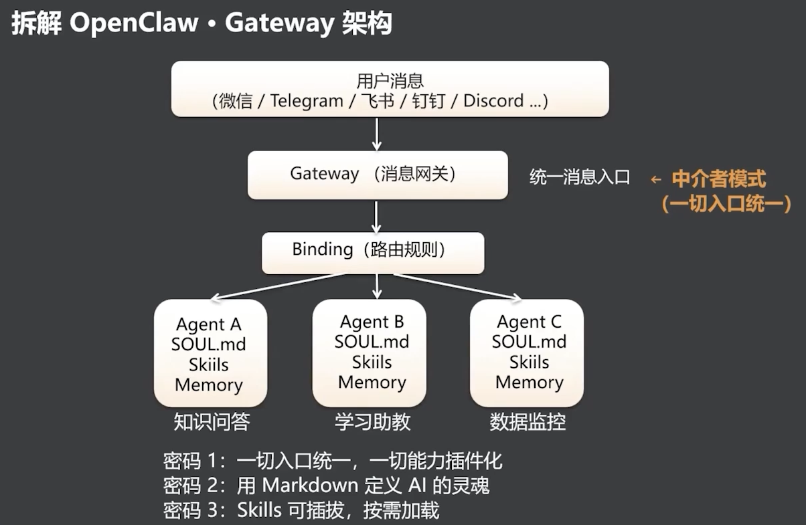

# 拆解 OpenClaw · Gateway 架构

> OpenClaw 以 Gateway 统一接入多个消息渠道，再由 Binding 将请求路由给拥有独立灵魂、技能和记忆的 Agent。

- 用户消息可来自微信、Telegram、飞书、钉钉、Discord 等不同渠道。
- `Gateway`（消息网关）采用中介者模式，将多渠道收敛为统一消息入口。
- `Binding`（路由规则）根据消息和配置，把任务分发给对应的 Agent。
- 每个 Agent 均可拥有独立的 `SOUL.md`、Skills 和 Memory，从而承担知识问答、学习助教、数据监控等不同角色。

## 三个设计密码

1. 一切入口统一，一切能力插件化。
2. 用 Markdown 定义 AI 的灵魂。
3. Skills 可插拔，按需加载。

**Gateway 统一“从哪里来”，Binding 决定“到哪里去”，Agent 则将灵魂、能力与记忆组装成可独立运行的角色。**

---
*从 OpenClaw 到 Open Code · 拆解爆款 Agent 的设计密码与工程范式 · 2026-07-10*
*黄佳 · 讲师*
