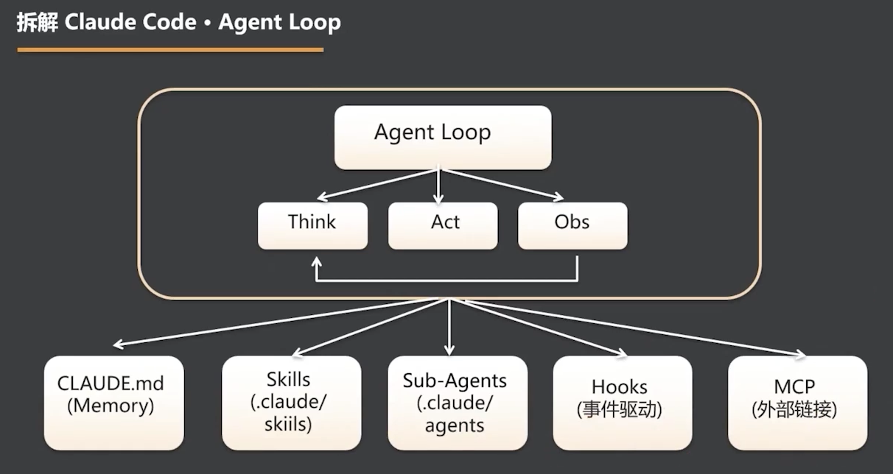

# 拆解 Claude Code · Agent Loop

> Claude Code 以 Think、Act、Obs 的循环为运行核心，再通过规范、技能、子 Agent、事件和外部连接扩展执行能力。

- `Think`：理解任务、分析当前状态并决定下一步。
- `Act`：调用工具或执行操作，对环境产生实际影响。
- `Obs`：观察执行结果，将新信息送回 `Think` 开始下一轮循环。
- Agent Loop 不是一次性的问答链，而是持续思考、行动、反馈的闭环。

## 五类工程能力

- `CLAUDE.md`（Memory）：保存项目规范与持续上下文。
- `Skills`（`.claude/skills`）：将专项能力封装为可按需加载的模块。
- `Sub-Agents`（`.claude/agents`）：把任务分解给专职角色协作完成。
- `Hooks`（事件驱动）：在特定事件发生时自动触发逻辑。
- `MCP`（外部链接）：将 Agent 连接到外部工具、数据与服务。

**Agent Loop 决定 Claude Code 如何思考与行动，五类工程能力则决定它知道什么、会做什么、能与谁协作。**

---
*从 OpenClaw 到 Open Code · 拆解爆款 Agent 的设计密码与工程范式 · 2026-07-10*
*黄佳 · 讲师*
