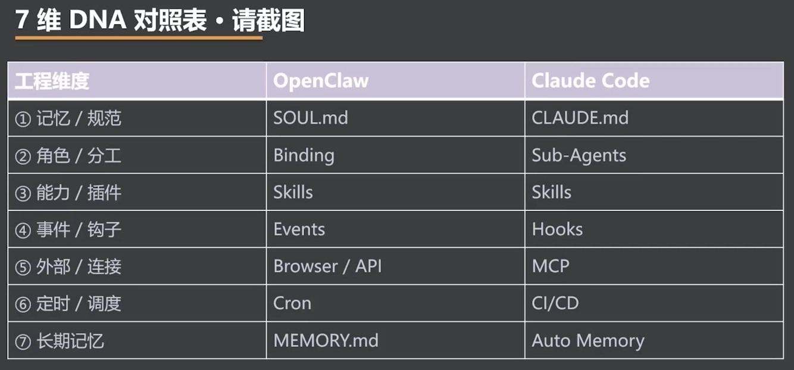

# 7 维 DNA 对照表 · 请截图

> OpenClaw 与 Claude Code 共享同一套 Agent 工程 DNA，但在记忆、分工、事件、外部连接和调度等维度上选择了不同的实现载体。

- 两者都将记忆与规范、角色分工、能力插件化作为核心工程问题。
- Skills 是两套架构最直接的共识：能力应当可插拔、可复用、可按需加载。
- OpenClaw 偏向长期运行的消息入口与自动化调度，Claude Code 偏向开发环境中的任务执行与工程集成。

## 七维工程映射

| 工程维度 | OpenClaw | Claude Code |
|---|---|---|
| ① 记忆 / 规范 | `SOUL.md` | `CLAUDE.md` |
| ② 角色 / 分工 | Binding | Sub-Agents |
| ③ 能力 / 插件 | Skills | Skills |
| ④ 事件 / 钩子 | Events | Hooks |
| ⑤ 外部 / 连接 | Browser / API | MCP |
| ⑥ 定时 / 调度 | Cron | CI/CD |
| ⑦ 长期记忆 | `MEMORY.md` | Auto Memory |

**产品形态可以不同，但成熟 Agent 系统都在回答同七个工程问题。**

---
*从 OpenClaw 到 Open Code · 拆解爆款 Agent 的设计密码与工程范式 · 2026-07-10*
*黄佳 · 讲师*
