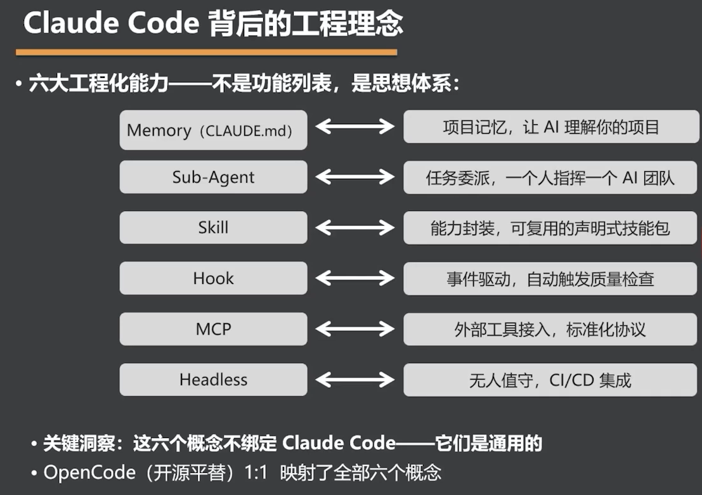

# Claude Code 背后的工程理念

> Claude Code 的六大工程化能力不是一组孤立功能，而是围绕记忆、分工、复用、自动化、连接与无人值守建立的通用 Agent 工程体系。

- `Memory`（`CLAUDE.md`）：建立项目记忆，让 AI 理解项目背景、规范与约束。
- `Sub-Agent`：实现任务委派，让一个人可以指挥一个 AI 团队。
- `Skill`：封装可复用能力，形成声明式技能包。
- `Hook`：通过事件驱动逻辑，自动触发质量检查等流程。
- `MCP`：以标准化协议接入外部工具与数据。
- `Headless`：支持无人值守执行，并集成到 CI/CD 流程。

## 从产品功能到通用范式

- 这六个概念并不绑定 Claude Code，它们描述的是可迁移的 Agent 工程思想。
- OpenCode 作为开源平替，已经 1:1 映射了全部六个概念。
- 判断一个 Agent 工具时，应关注它是否覆盖这套工程闭环，而不只是对比表面功能数量。

**产品会更替，但项目记忆、任务委派、能力复用、事件驱动、标准连接与无人值守这六种工程思想会持续存在。**

---
*从 OpenClaw 到 Open Code · 拆解爆款 Agent 的设计密码与工程范式 · 2026-07-10*
*黄佳 · 讲师*
