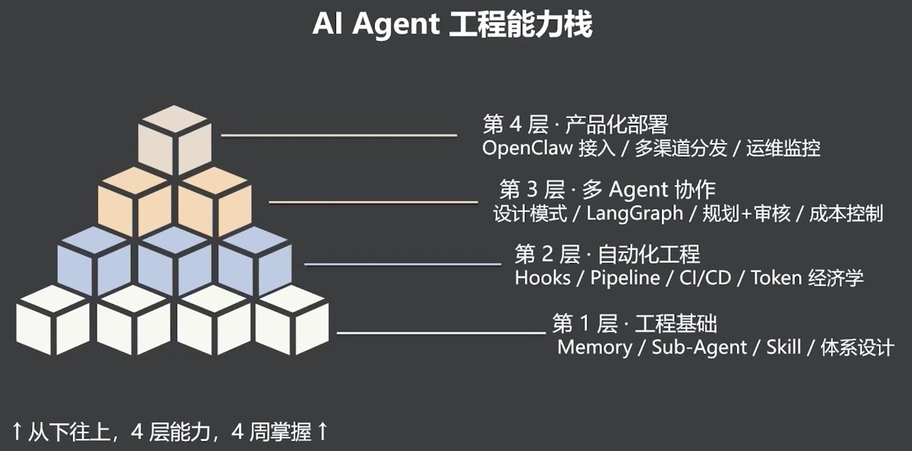

# AI Agent 工程能力栈

> AI Agent 工程能力需要自下而上逐层构建：先打好单 Agent 工程基础，再实现自动化、多 Agent 协作和产品化部署。

- 能力栈分为四层，每一层都以下一层为基础。
- 第 1 层解决 Agent 如何记住项目、分配角色、封装能力与形成体系。
- 第 2 层将人工步骤转化为可重复、可检查、可控制成本的自动化流程。
- 第 3 层用编排、规划与审核机制将多个 Agent 组成协作系统。
- 第 4 层将已稳定的 Agent 系统接入真实渠道，并建立运维与监控能力。

## 四层能力栈

| 层级 | 主题 | 关键能力 |
|---|---|---|
| 第 1 层 | 工程基础 | Memory / Sub-Agent / Skill / 体系设计 |
| 第 2 层 | 自动化工程 | Hooks / Pipeline / CI/CD / Token 经济学 |
| 第 3 层 | 多 Agent 协作 | 设计模式 / LangGraph / 规划+审核 / 成本控制 |
| 第 4 层 | 产品化部署 | OpenClaw 接入 / 多渠道分发 / 运维监控 |

**先让 Agent 具备可工程化的基础，再让流程自动运行、团队协同工作，最后才能稳定地产品化。**

---
*从 OpenClaw 到 Open Code · 拆解爆款 Agent 的设计密码与工程范式 · 2026-07-10*
*黄佳 · 讲师*
