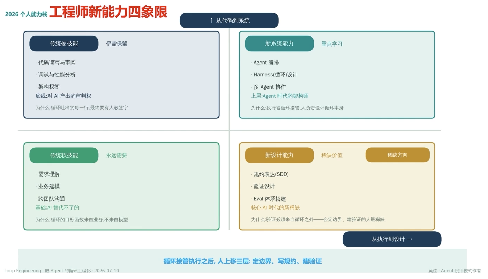

# 2026 个人能力栈 · 工程师新能力四象限

> ↑ 从代码到系统

## 传统硬技能（仍需保留）

- 代码读写与审阅
- 调试与性能分析
- 架构权衡

**底线**：对 AI 产出的审判权
**为什么**：循环吐出的每一行，最终要有人敢签字

## 新系统能力（重点学习）

- Agent 编排
- Harness（循环）设计
- 多 Agent 协作

**上层**：Agent 时代的架构师
**为什么**：执行被循环接管，人负责设计循环本身

## 传统软技能（永远需要）

- 需求理解
- 业务建模
- 跨团队沟通

**基础**：AI 替代不了的
**为什么**：循环的目标函数来自业务，不来自模型

## 新设计能力（稀缺价值 / 稀缺方向）

- 规约表达（SDD）
- 验证设计
- Eval 体系搭建

**核心**：AI 时代的新稀缺
**为什么**：验证必须来自循环之外——会定边界、建验证的人最稀缺

---

**循环接管执行之后，人上移三层：定边界、写规约、建验证**
从执行到设计 →

---
*Loop Engineering · 把 Agent 的循环工程化 · 2026-07-10*
*黄佳 · Agent 设计模式作者*
