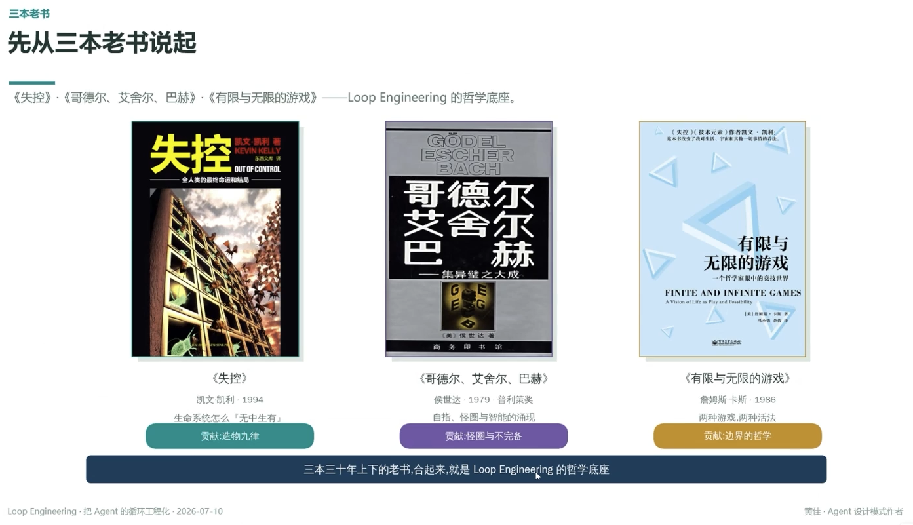

# 先从三本老书说起

> 《失控》《哥德尔、艾舍尔、巴赫》《有限与无限的游戏》——Loop Engineering 的哲学底座

## 《失控》

**作者**：凯文·凯利 · 1994
**主题**：生命系统怎么『无中生有』
**贡献**：造物九律

## 《哥德尔、艾舍尔、巴赫》

**作者**：侯世达 · 1979 · 普利策奖
**主题**：自指、怪圈与智能的涌现
**贡献**：怪圈与不完备

## 《有限与无限的游戏》

**作者**：詹姆斯·卡斯 · 1986
**主题**：两种游戏，两种活法
**贡献**：边界的哲学

---

**三本三十年上下的老书，合起来，就是 Loop Engineering 的哲学底座**

---
*Loop Engineering · 把 Agent 的循环工程化 · 2026-07-10*
*黄佳 · Agent 设计模式作者*
