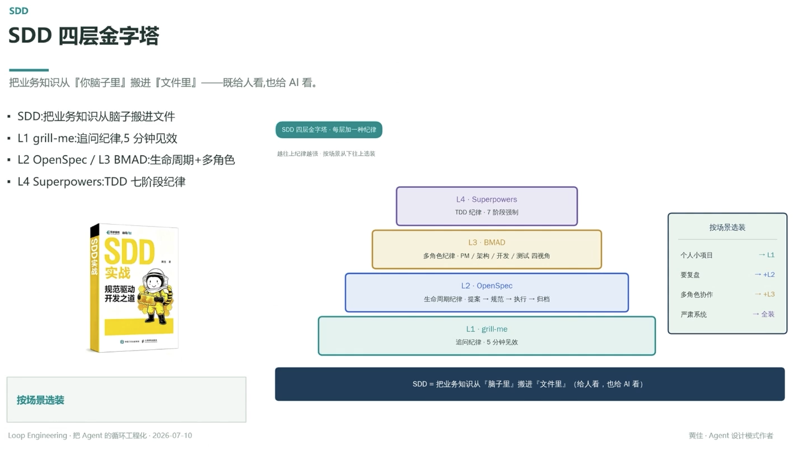

# SDD 四层金字塔

> 把业务知识从『你脑子里』搬进『文件里』——既给人看，也给 AI 看

## L1 · grill-me

**纪律**：追问纪律 · 5 分钟见效
**为什么**：入门门槛最低，靠反复追问澄清需求，个人小项目够用

## L2 · OpenSpec

**纪律**：生命周期纪律 · 提案 → 规范 → 执行 → 归档
**为什么**：需要复盘的项目，靠完整生命周期留痕

## L3 · BMAD

**纪律**：多角色纪律 · PM / 架构 / 开发 / 测试 四视角
**为什么**：多角色协作场景，靠角色分工避免单点视角盲区

## L4 · Superpowers

**纪律**：TDD 纪律 · 7 阶段强制
**为什么**：严肃系统全装，靠强制阶段把纪律焊死

---

**按场景选装**：个人小项目 → L1；要复盘 → +L2；多角色协作 → +L3；严肃系统 → 全装
越往上纪律越强，按场景从下往上选装

---

**SDD = 把业务知识从『脑子里』搬进『文件里』（给人看，也给 AI 看）**

---
*Loop Engineering · 把 Agent 的循环工程化 · 2026-07-10*
*黄佳 · Agent 设计模式作者*
