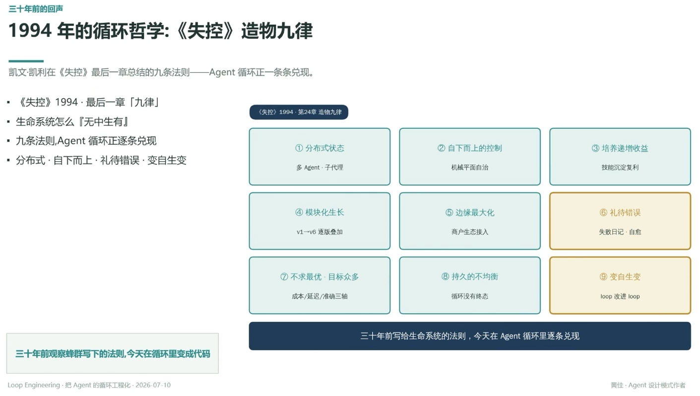

# 1994 年的循环哲学：《失控》造物九律

> 凯文·凯利在《失控》最后一章总结的九条法则——Agent 循环正一条条兑现

## ① 分布式状态

多 Agent · 子代理

## ② 自下而上的控制

机械平面自治

## ③ 培养递增收益

技能沉淀复利

## ④ 模块化生长

v1 → v6 逐版叠加

## ⑤ 边缘最大化

商户生态接入

## ⑥ 礼待错误

失败日记 · 自愈

## ⑦ 不求最优 · 目标众多

成本 / 延迟 / 准确三轴

## ⑧ 持久的不均衡

循环没有终态

## ⑨ 变自生变

loop 改进 loop

---

**三十年前观察蜂群写下的法则，今天在循环里变成代码**
三十年前写给生命系统的法则，今天在 Agent 循环里逐条兑现

---
*Loop Engineering · 把 Agent 的循环工程化 · 2026-07-10*
*黄佳 · Agent 设计模式作者*
