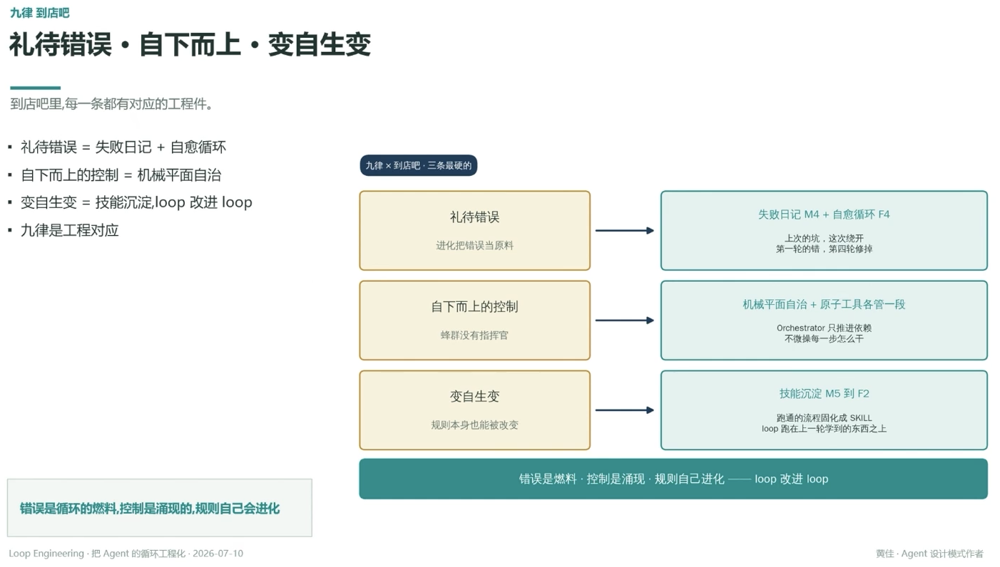

# 礼待错误 · 自下而上 · 变自生变

> 到店吧里，每一条都有对应的工程件

## 礼待错误 = 失败日记 + 自愈循环

**工程对应**：失败日记 M4 + 自愈循环 F4
**说明**：上次的坑，这次绕开；第一轮的错，第四轮修掉

## 自下而上的控制 = 机械平面自治

**工程对应**：机械平面自治 + 原子工具各管一段
**说明**：Orchestrator 只推进依赖，不微操每一步怎么干（蜂群没有指挥官）

## 变自生变 = 技能沉淀，loop 改进 loop

**工程对应**：技能沉淀 M5 到 F2
**说明**：跑通的流程固化成 SKILL，loop 跑在上一轮学到的东西之上（规则本身也能被改变）

---

**错误是循环的燃料，控制是涌现的，规则自己会进化**
错误是燃料 · 控制是涌现 · 规则自己进化 —— loop 改进 loop

---
*Loop Engineering · 把 Agent 的循环工程化 · 2026-07-10*
*黄佳 · Agent 设计模式作者*
