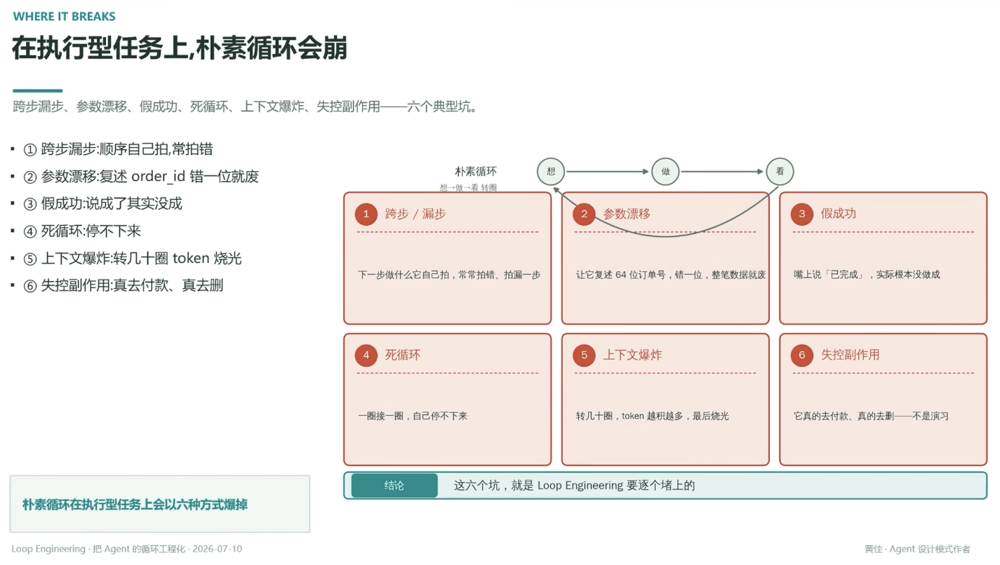

# 在执行型任务上，朴素循环会崩

> 跨步漏步、参数漂移、假成功、死循环、上下文爆炸、失控副作用——六个典型坑

朴素循环：想 → 做 → 看，转圈

## ① 跨步 / 漏步

顺序自己拍，常拍错——下一步做什么它自己拍，常拍错、拍漏一步

## ② 参数漂移

复述 order_id 错一位就废——让它复述 64 位订单号，错一位，整笔数据就废

## ③ 假成功

说成了其实没成——嘴上说「已完成」，实际根本没做成

## ④ 死循环

停不下来——一圈接一圈，自己停不下来

## ⑤ 上下文爆炸

转几十圈 token 烧光——转几十圈，token 越积越多，最后烧光

## ⑥ 失控副作用

真去付款、真去删——它真的去付款、真的去删——不是演习

---

**朴素循环在执行型任务上会以六种方式爆掉**

**结论**：这六个坑，就是 Loop Engineering 要逐个堵上的

---
*Loop Engineering · 把 Agent 的循环工程化 · 2026-07-10*
*黄佳 · Agent 设计模式作者*
