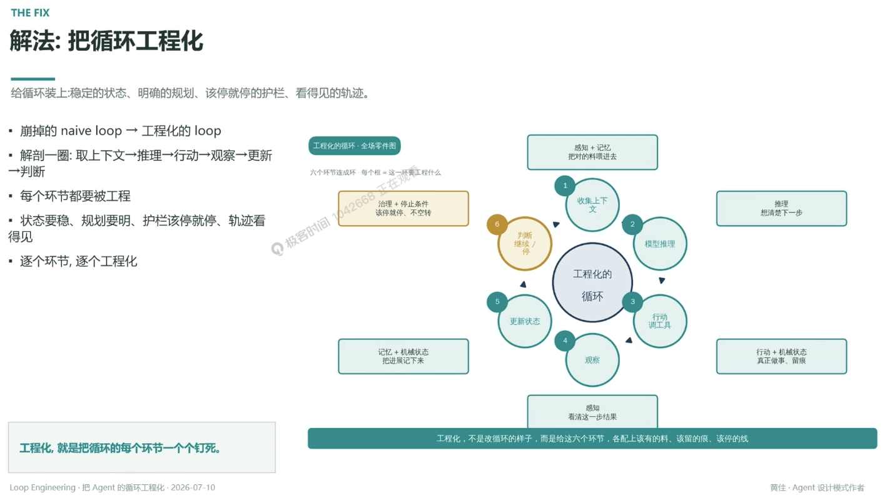

# 解法：把循环工程化

> 给循环装上稳定的状态、明确的规划、该停就停的护栏、看得见的轨迹

- 崩掉的 naive loop → 工程化的 loop
- 解剖一圈：取上下文 → 推理 → 行动 → 观察 → 更新 → 判断
- 每个环节都要被工程
- 状态要稳、规划要明、护栏该停就停、轨迹看得见
- 逐个环节，逐个工程化

## ① 收集上下文

感知 + 记忆：把对的料喂进去

## ② 模型推理

推理：想清楚下一步

## ③ 行动调工具

行动 + 机械状态：真正做事、留痕

## ④ 观察

感知：看清这一步结果

## ⑤ 更新状态

记忆 + 机械状态：把进展记下来

## ⑥ 判断继续 / 停

治理 + 停止条件：该停就停、不空转

---

**工程化，就是把循环的每个环节一个个钉死**
工程化，不是改循环的样子，而是给这六个环节，各配上该有的料、该留的痕、该停的线

---
*Loop Engineering · 把 Agent 的循环工程化 · 2026-07-10*
*黄佳 · Agent 设计模式作者*
