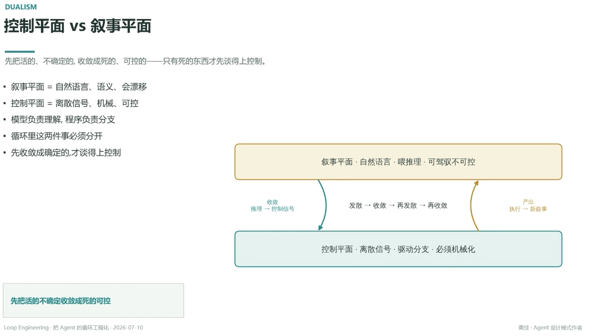

# 控制平面 vs 叙事平面

> 先把活的、不确定的，收敛成死的、可控的——只有死的东西才谈得上控制

- 叙事平面 = 自然语言、语义、会漂移
- 控制平面 = 离散信号、机械、可控
- 模型负责理解，程序负责分支
- 循环里这两件事必须分开
- 先收敛成确定的，才谈得上控制

## 叙事平面

自然语言 · 喂推理 · 可驾驭不可控

**收敛**（推理 → 控制信号）→ 控制平面

## 控制平面

离散信号 · 驱动分支 · 必须机械化

**产出**（执行 → 新叙事）→ 回到叙事平面

两者之间循环往复：发散 → 收敛 → 再发散 → 再收敛

---

**先把活的不确定收敛成死的可控**

---
*Loop Engineering · 把 Agent 的循环工程化 · 2026-07-10*
*黄佳 · Agent 设计模式作者*
