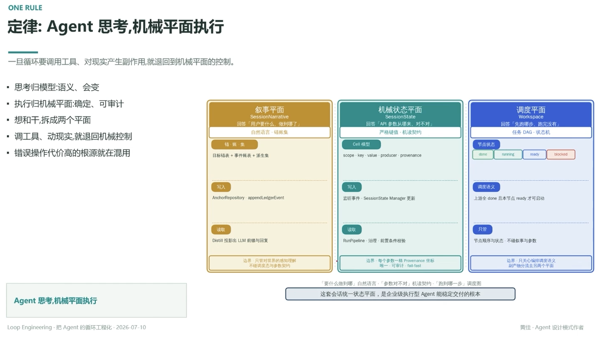

# 定律：Agent 思考，机械平面执行

> 一旦循环要调用工具、对现实产生副作用，就退回到机械平面的控制

- 思考归模型：语义、会变
- 执行归机械平面：确定、可审计
- 想和干，拆成两个平面
- 调工具、动现实，就退回机械控制
- 错误操作代价高的根源就在混用

## 叙事平面 · SessionNarrative

**回答**：用户要什么、做到哪了
**载体**：自然语言 · 锚账集
**写入**：AnchorRepository · appendLedgerEvent（目标锚表 + 事件账表 + 派生集）
**读取**：Distill 投影出 LLM 前缀与回复
**边界**：只管对世界的感知理解，不碰调度态与参数契约

## 机械状态平面 · SessionState

**回答**：API 参数从哪来、对不对
**载体**：严格键值 · 机读契约
**写入**：监听事件 · SessionState Manager 更新（scope · key · value · producer · provenance）
**读取**：RunPipeline · 治理前置条件校验
**边界**：每个参数一格 Provenance 坐标，唯一 · 可审计 · fail-fast

## 调度平面 · Workspace

**回答**：先跑哪步、跑完没有
**载体**：任务 DAG · 状态机
**节点状态**：done / running / ready / blocked
**调度语义**：上游全 done 且本节点 ready 才可启动
**只管**：节点顺序与状态，不碰叙事与参数
**边界**：只关心编排调度语义，副产物分流去另两个平面

---

**Agent 思考，机械平面执行**
「要什么做到哪」自然语言 ·「参数对不对」机读契约 ·「跑到哪一步」调度图
这套会话统一状态平面，是企业级执行型 Agent 能稳定交付的根本

---
*Loop Engineering · 把 Agent 的循环工程化 · 2026-07-10*
*黄佳 · Agent 设计模式作者*
