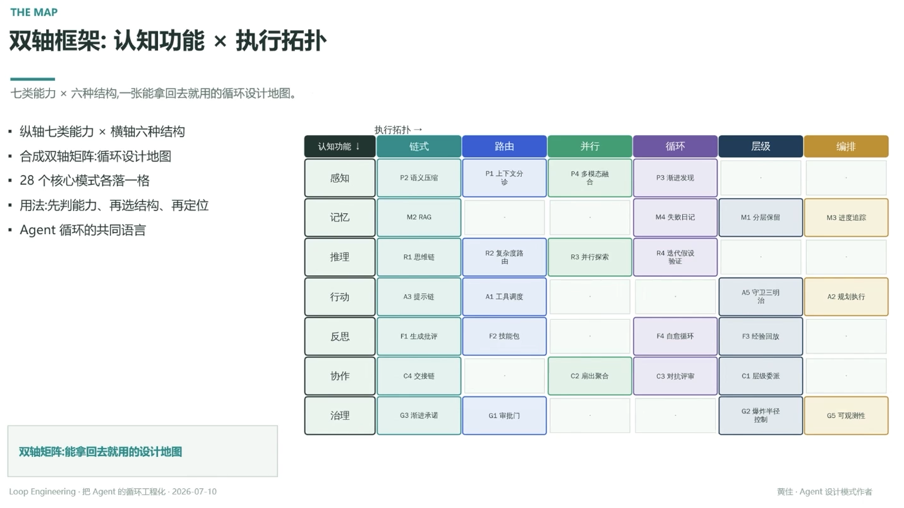

# 双轴框架：认知功能 × 执行拓扑

> 七类能力 × 六种结构，一张能拿回去就用的循环设计地图

- 纵轴七类能力 × 横轴六种结构
- 合成双轴矩阵：循环设计地图
- 28 个核心模式各落一格
- 用法：先判能力、再选结构、再定位
- Agent 循环的共同语言

## 循环设计地图（28 个核心模式）

| 认知功能 ↓ / 执行拓扑 → | 链式 | 路由 | 并行 | 循环 | 层级 | 编排 |
|---|---|---|---|---|---|---|
| **感知** | P2 语义压塞 | P1 上下文分诊 | P4 多模态融合 | P3 渐进发现 | . | . |
| **记忆** | M2 RAG | . | . | M4 失败日记 | M1 分层保留 | M3 进度追踪 |
| **推理** | R1 思维链 | R2 复杂度路由 | R3 并行探索 | R4 迭代假设验证 | . | . |
| **行动** | A3 提示链 | A1 工具调度 | . | . | A5 守卫三明治 | A2 规划执行 |
| **反思** | F1 生成批评 | F2 技能包 | . | F4 自愈循环 | F3 经验回放 | . |
| **协作** | C4 交接链 | . | C2 扇出聚合 | C3 对抗评审 | C1 层级委派 | . |
| **治理** | G3 渐进承诺 | G1 审批门 | . | . | G2 爆炸半径控制 | G5 可观测性 |

---

**双轴矩阵：能拿回去就用的设计地图**

---
*Loop Engineering · 把 Agent 的循环工程化 · 2026-07-10*
*黄佳 · Agent 设计模式作者*
