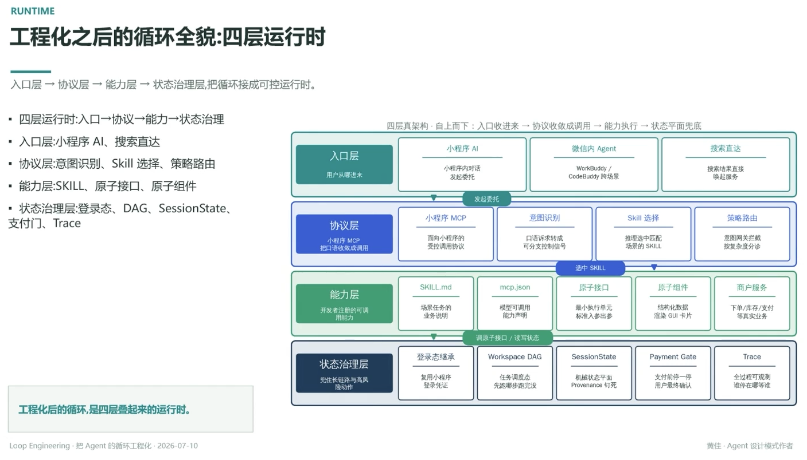

# 工程化之后的循环全貌：四层运行时

> 入口层 → 协议层 → 能力层 → 状态治理层，把循环接成可控运行时

- 四层运行时：入口 → 协议 → 能力 → 状态治理
- 入口层：小程序 AI、搜索直达
- 协议层：意图识别、Skill 选择、策略路由
- 能力层：SKILL、原子接口、原子组件
- 状态治理层：登录态、DAG、SessionState、支付门、Trace

四层真架构，自上而下：入口收进来 → 协议收敛成调用 → 能力执行 → 状态平面兜底

## 入口层（用户从哪进来）

- **小程序 AI**：小程序内对话发起委托
- **微信内 Agent**：WorkBuddy / CodeBuddy 跨场景
- **搜索直达**：搜索结果直接唤起服务

↓ 发起委托

## 协议层（小程序 MCP，把口语收敛成调用）

- **小程序 MCP**：面向小程序的受控调用协议
- **意图识别**：口语诉求转成可分支控制信号
- **Skill 选择**：推理选中匹配场景的 SKILL
- **策略路由**：意图网关拦截，按复杂度分诊

↓ 选中 SKILL

## 能力层（开发者注册的可调用能力）

- **SKILL.md**：场景任务的业务说明
- **mcp.json**：模型可调用能力声明
- **原子接口**：最小执行单元，标准入参出参
- **原子组件**：结构化数据渲染 GUI 卡片
- **商户服务**：下单 / 库存 / 支付等真实业务

↓ 调原子接口 / 读写状态

## 状态治理层（兜住长链路与高风险动作）

- **登录态继承**：复用小程序登录凭证
- **Workspace DAG**：任务调度态，先跑哪步、跑完没没
- **SessionState**：机械状态平面，Provenance 稳
- **Payment Gate**：支付前停一停，用户最终确认
- **Trace**：全过程可观测，谁做的、在哪一步、谁审的

---

**工程化后的循环，是四层叠起来的运行时**

---
*Loop Engineering · 把 Agent 的循环工程化 · 2026-07-10*
*黄佳 · Agent 设计模式作者*
