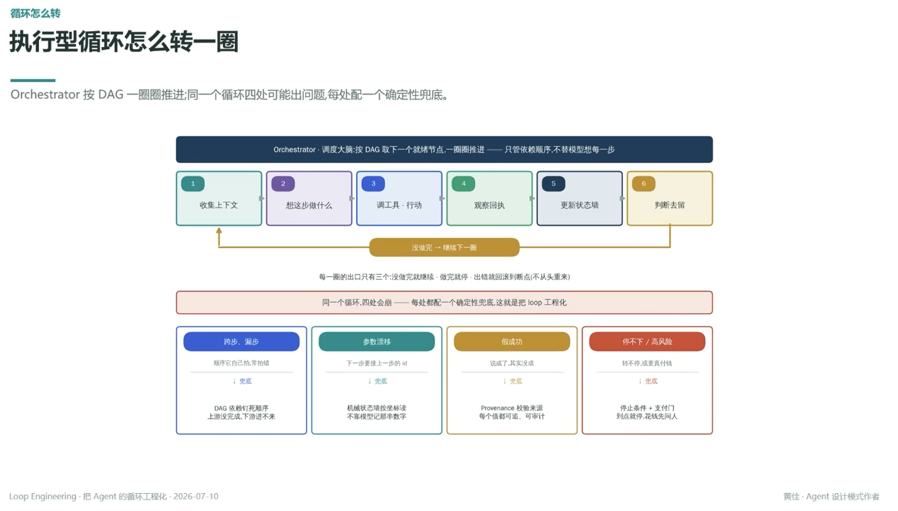

# 执行型循环怎么转一圈

> Orchestrator 按 DAG 一圈圈推进；同一个循环四处可能出问题，每处配一个确定性兜底

**Orchestrator · 调度大脑**：按 DAG 取下一个就绪节点，一圈圈推进 —— 只管依赖顺序，不替模型想每一步

## 一圈六步

1. 收集上下文
2. 想这步做什么
3. 调工具 · 行动
4. 观察回执
5. 更新状态墙
6. 判断去留

没做完 → 继续下一圈

每一圈的出口只有三个：没做完就继续 · 做完就停 · 出错就回滚到断点（不从头重来）

---

**同一个循环，四处会崩 —— 每处都配一个确定性兜底，这就是把 loop 工程化**

## 跨步、漏步

顺序它自己拍，常拍错
↓ 兜底
DAG 依赖钉死顺序，上游没完成，下游进不来

## 参数漂移

下一步要接上一步的 id
↓ 兜底
机械状态墙按坐标读，不靠模型记那串数字

## 假成功

说成了，其实没成
↓ 兜底
Provenance 校验来源，每个值都可追、可审计

## 停不下 / 高风险

转不停，或要真付钱
↓ 兜底
停止条件 + 支付门，到点就停，花钱先问人

---
*Loop Engineering · 把 Agent 的循环工程化 · 2026-07-10*
*黄佳 · Agent 设计模式作者*
