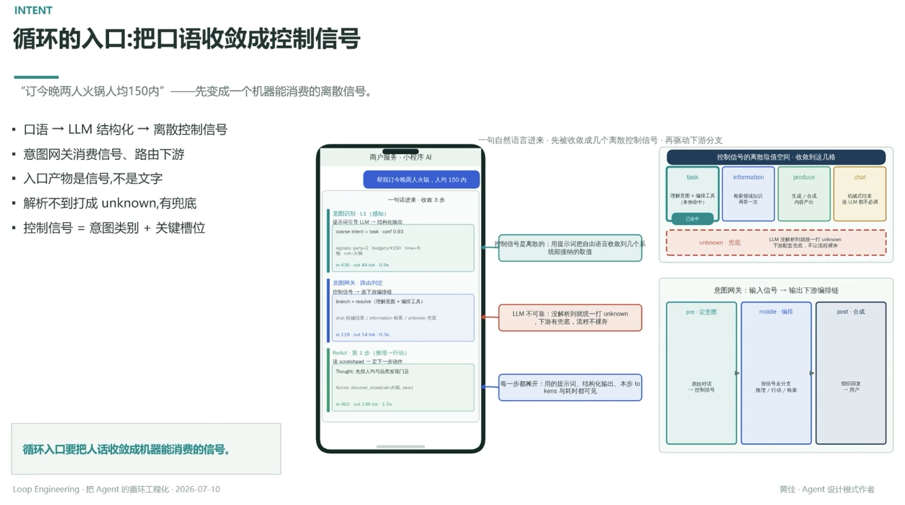

# 循环的入口：把口语收敛成控制信号

> "订今晚两人火锅人均 150 内"——先变成一个机器能消费的离散信号

- 口语 → LLM 结构化 → 离散控制信号
- 意图网关消费信号、路由下游
- 入口产物是信号，不是文字
- 解析不到打成 unknown，有兜底
- 控制信号 = 意图类别 + 关键槽位

## 一句话进来，收敛 3 步

1. **意图识别 L1（感知）**：提示词引导 LLM → 结构化输出，如 `coarse intent = task, conf 0.93`，信号如 `party=2, budget=¥150, time=晚, cat=火锅`
2. **意图网关（路由）**：控制信号 → 选下游编排链，`branch = resolve`（理解意图 + 编排工具），也可能是 `chat`（机械结果 / information 检索 / unknown 兜底）
3. **ReAct（推理 → 行动）**：读 scratchpad → 定下一步行动，如 `discover_store(cat=火锅, near)`

## 控制信号的离散取值空间

收到这几格：`task`（理解意图 + 编排工具，本例命中）、`information`（检索知识库再答）、`produce`（生成/合成内容，不必调 LLM）、`chat`（机械回复，连 LLM 都不必调）

**unknown 是兜底**：LLM 没解析到就统一打 unknown，下游有配套兜底，不让流程裸奔

## 意图网关：输入信号 → 输出下游编排链

pre（定意图）→ middle（编排：按信号走分支，推理/行动/检索）→ post（合成回复给用户）

---

**循环入口要把人话收敛成机器能消费的信号**

---
*Loop Engineering · 把 Agent 的循环工程化 · 2026-07-10*
*黄佳 · Agent 设计模式作者*
