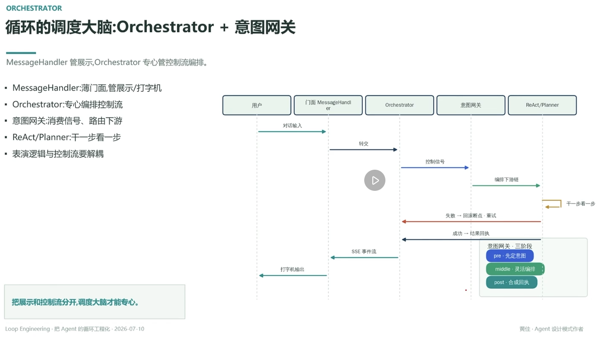

# 循环的调度大脑：Orchestrator + 意图网关

> MessageHandler 管展示，Orchestrator 专心管控制流编排

- **MessageHandler**：薄门面，管展示 / 打字机
- **Orchestrator**：专心编排控制流
- **意图网关**：消费信号、路由下游
- **ReAct/Planner**：干一步看一步
- 表演逻辑与控制流要解耦

## 一次请求的时序

用户 → MessageHandler（对话输入）→ Orchestrator（转交）→ 意图网关（控制信号）→ ReAct/Planner（编排下游链，干一步看一步）

- 失败 → 回滚断点 · 重试（走回意图网关 → Orchestrator）
- 成功 → 结果回执 → Orchestrator → MessageHandler（SSE 事件流 → 打字机输出）

## 意图网关 · 三阶段

pre（先定意图）→ middle（灵活编排）→ post（合成回执）

---

**把展示和控制流分开，调度大脑才能专心**

---
*Loop Engineering · 把 Agent 的循环工程化 · 2026-07-10*
*黄佳 · Agent 设计模式作者*
