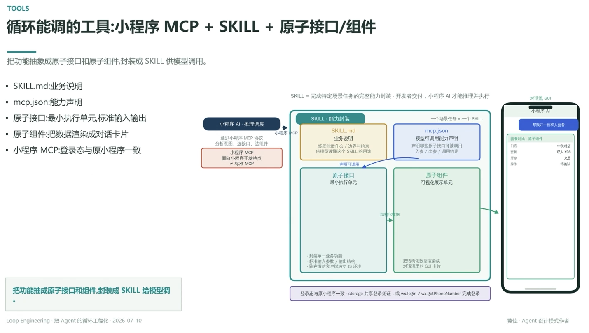

# 循环能调的工具：小程序 MCP + SKILL + 原子接口/组件

> 把功能抽象成原子接口和原子组件，封装成 SKILL 供模型调用

- **SKILL.md**：业务说明
- **mcp.json**：能力声明
- **原子接口**：最小执行单元，标准输入输出
- **原子组件**：把数据渲染成对话卡片
- **小程序 MCP**：登录态与原小程序一致

## SKILL · 能力封装

一个场景任务 = 一个 SKILL：`SKILL.md`（业务说明，场景能做什么/边界与约束，供模型读懂这个用途）+ `mcp.json`（模型可调用能力声明，哪些原子接口可被调用、入参/出参/调用约定）

声明可调用 → **原子接口**（最小执行单元：封装单一业务功能、标准输入参数/输出结构、跑在微信客户端独立 JS 环境）+ **原子组件**（可视化展示单元：把结构化数据渲染成对话流里的 GUI 卡片）

## 调度链路

小程序 AI（推理调度）→ 通过小程序 MCP 协议：分析意图、选接口、选组件 → SKILL 能力封装 → 原子接口/原子组件 → 对话流 GUI（打字机输出 + 卡片）

小程序 MCP 面向小程序开发特点，≠ 标准 MCP；登录态与原小程序一致 —— storage 共享登录凭证，或 `wx.login`/`wx.getPhoneNumber` 完成登录

---

**把功能抽成原子接口和组件，封装成 SKILL 给模型调**

---
*Loop Engineering · 把 Agent 的循环工程化 · 2026-07-10*
*黄佳 · Agent 设计模式作者*
