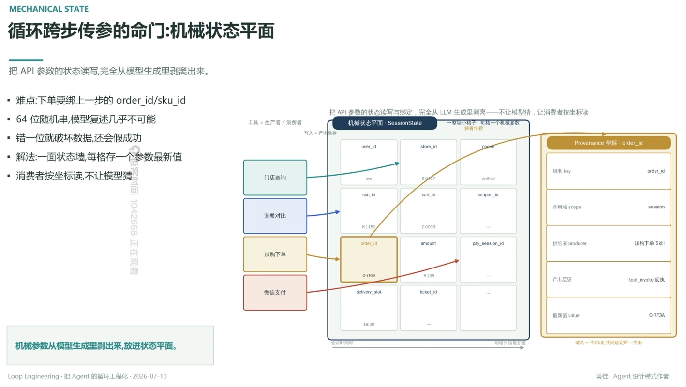

# 循环跨步传参的命门：机械状态平面

> 把 API 参数的状态读写，完全从模型生成里剥离出来

- 难点：下单要绑上一步的 `order_id`/`sku_id`
- 64 位随机串，模型复述几乎不可能
- 错一位就破坏数据，还会假成功
- 解法：一面状态墙，每格存一个参数最新值
- 消费者按坐标读，不让模型猜

## 机械状态平面 · SessionState

工具 = 生产者 / 消费者，写入 = 产生坐标：一整墙小格子，每格一个机械参数，解析坐标

- 门店查询 → 写 `store_id`
- 套餐对比 → 写 `sku_id`/`cart_id`
- 加购下单 → 写 `order_id`（如 `O-7F3A`）/`amount`/`pay_session_id`
- 微信支付 → 按坐标读 `order_id`，写 `delivery_slot`/`ticket_id`

横轴是会话时间轴，纵轴每格只留最新值

## Provenance 坐标（以 order_id 为例）

键名 key = `order_id`，作用域 scope = `session`，供给者 producer = 加购下单 Skill，产出层级 = `tool_invoke` 回执，最新值 value = `O-7F3A`

**键名 + 作用域，共同确定唯一坐标**

---

**机械参数从模型生成里剥出来，放进状态平面**

---
*Loop Engineering · 把 Agent 的循环工程化 · 2026-07-10*
*黄佳 · Agent 设计模式作者*
