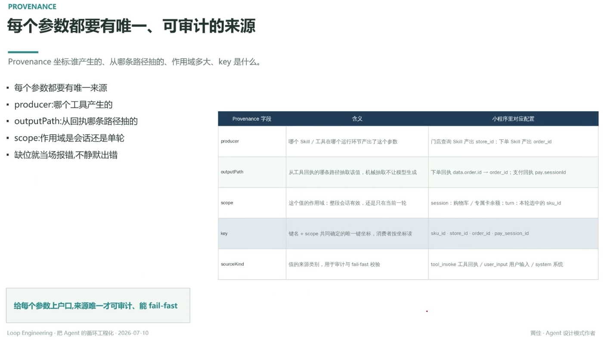

# 每个参数都要有唯一、可审计的来源

> Provenance 坐标：谁产生的、从哪条路径抽的、作用域多大、key 是什么

- 每个参数都要有唯一来源
- producer：哪个工具产生的
- outputPath：从回执哪条路径抽的
- scope：作用域是会话还是单轮
- 缺位就当场报错，不静默出错

## Provenance 字段

| 字段 | 含义 | 小程序里对应配置 |
|---|---|---|
| producer | 哪个 Skill / 工具在哪个运行环节产出了这个参数 | 门店查询 Skill 产出 `store_id`；下单 Skill 产出 `order_id` |
| outputPath | 从工具回执的哪条路径抽取该值，机械抽取不让模型生成 | 下单回执 `data.order.id → order_id`；支付回执 `pay.sessionId` |
| scope | 这个值的作用域：整段会话有效，还是只在当前一轮 | session：购物车/专属卡余额；turn：本轮选中的 `sku_id` |
| key | 键名 + scope 共同确定的唯一键坐标，消费者按坐标读 | `sku_id`·`store_id`·`order_id`·`pay_session_id` |
| sourceKind | 值的来源类别，用于审计与 fail-fast 校验 | `tool_invoke` 工具回执 / `user_input` 用户输入 / `system` 系统 |

---

**给每个参数上户口，来源唯一才可审计、能 fail-fast**

---
*Loop Engineering · 把 Agent 的循环工程化 · 2026-07-10*
*黄佳 · Agent 设计模式作者*
