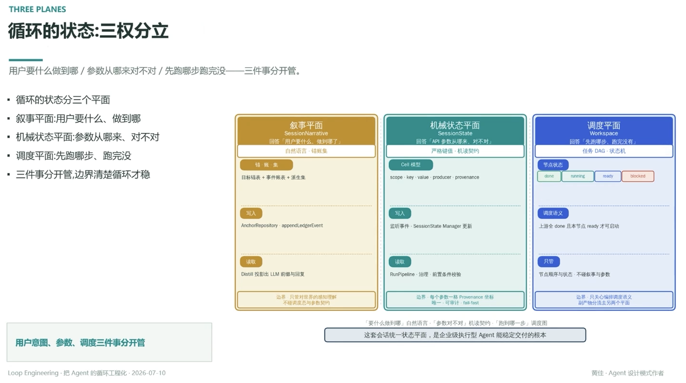

# 循环的状态：三权分立

> 用户要什么做到哪 / 参数从哪来对不对 / 先跑哪步跑完没——三件事分开管

- 循环的状态分三个平面
- 叙事平面：用户要什么、做到哪
- 机械状态平面：参数从哪来、对不对
- 调度平面：先跑哪步、跑完没
- 三件事分开管，边界清楚循环才稳

## 三个平面

**叙事平面 SessionNarrative**：回答「用户要什么、做到哪了」，自然语言 · 辑账集
- 写入：AnchorRepository、appendLedgerEvent（目标锚表 + 事件账表 + 派生集）
- 读取：Distill 投影出 LLM 前缀与回复
- 边界：只管对世界的感知理解，不碰调度态与参数契约

**机械状态平面 SessionState**：回答「API 参数从哪来、对不对」，严格键值 · 机读契约
- 写入：监听事件 · SessionState Manager 更新
- 读取：RunPipeline · 治理 · 前置条件校验
- 边界：每个参数一格 Provenance 坐标，唯一 · 可审计 · fail-fast（见 [[17.每个参数都要有唯一可审计的来源]]）

**调度平面 Workspace**：回答「先跑哪步、跑完没有」，任务 DAG · 状态机
- 节点状态：`done` / `running` / `ready` / `blocked`
- 调度语义：上游全 done 且本节点 ready 才可启动
- 边界：只管节点顺序与状态，不碰叙事与参数

「要什么做到哪」自然语言，「参数对不对」机读契约，「跑到哪一步」调度图

---

**用户意图、参数、调度三件事分开管——这套会话统一状态平面，是企业级执行型 Agent 能稳定交付的根本**

---
*Loop Engineering · 把 Agent 的循环工程化 · 2026-07-10*
*黄佳 · Agent 设计模式作者*
