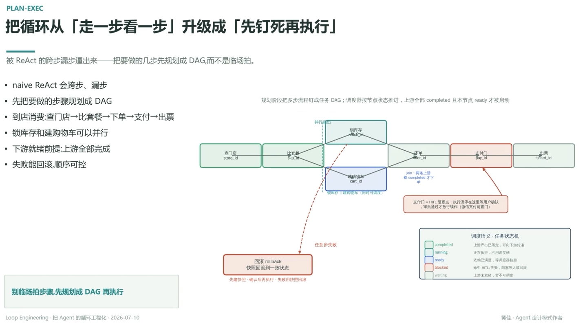

# 把循环从「走一步看一步」升级成「先钉死再执行」

> 被 ReAct 的跨步漏步逼出来——把要做的几步先规划成 DAG，而不是临场拍

- naive ReAct 会跨步、漏步
- 先把要做的步骤规划成 DAG
- 到店消费：查门店→比套餐→下单→支付→出票
- 锁库存和建购物车可以并行
- 下游就绪前提：上游全部完成
- 失败能回滚，顺序可控

## 任务 DAG · 到店消费

查门店 `store_id` → 比套餐 `sku_id` → **并行分叉**：锁库存 `stock_id` ‖ 建购物车 `cart_id`（同时可调度）→ **join**：两条都 completed 才下单 → 下单 `order_id` → 支付门 `pay_id`（HITL 阻塞点：执行流停在这里等用户确认，审批通过才放行续单，微信支付前置门）→ 出票 `ticket_id`

任意步失败 → 回滚 rollback：快照回滚到一致状态（先建快照 · 确认后再执行 · 失败用快照回滚）

## 调度语义 · 任务状态机

| 状态 | 含义 |
|---|---|
| completed | 上游产出已落定，可向下游传递 |
| running | 正在执行，占用调度槽 |
| ready | 依赖已就绪，等调度器拉起 |
| blocked | 命中 HITL/失败，阻塞等人或回滚 |
| waiting | 上游未就绪，暂不可调度 |

规划阶段把多步流程钉成任务 DAG；调度器按节点状态推进，上游全部 completed 且本节点 ready 才被启动

---

**别临场拍步骤，先规划成 DAG 再执行**

> **让计划活在代码里，让创意活在上下文里**

---
*Loop Engineering · 把 Agent 的循环工程化 · 2026-07-10*
*黄佳 · Agent 设计模式作者*
