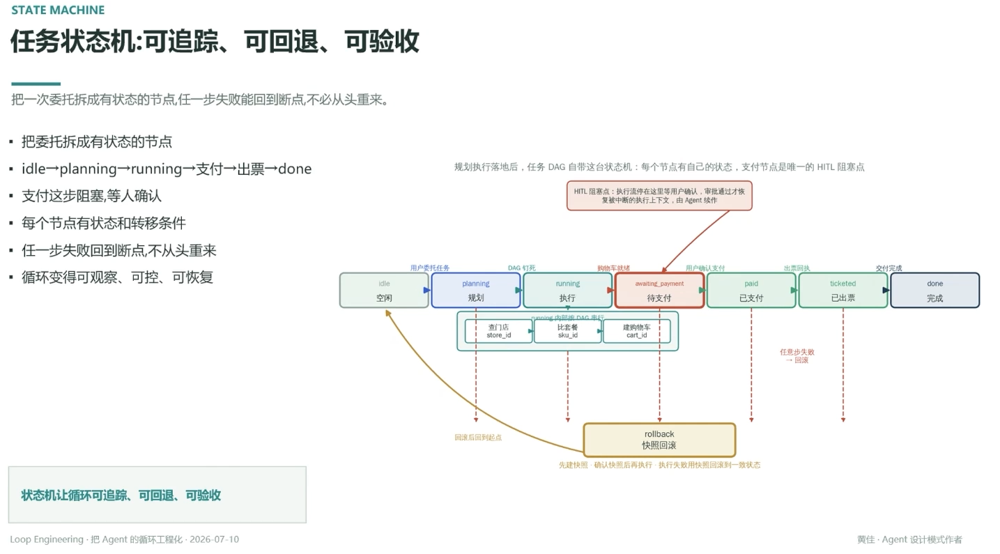

# 任务状态机：可追踪、可回退、可验收

> 把一次委托拆成有状态的节点，任一步失败能回到断点，不必从头重来

- 把委托拆成有状态的节点
- `idle→planning→running→支付→出票→done`
- 支付这步阻塞，等人确认
- 每个节点有状态和转移条件
- 任一步失败回到断点，不从头重来
- 循环变得可观察、可控、可恢复

## 状态流转 · 到店消费委托

`idle` 空闲 →（用户委托任务）→ `planning` 规划 →（DAG 钉死）→ `running` 执行（内嵌子 DAG：查门店 `store_id` → 比套餐 `sku_id` → 建购物车 `cart_id`，购物车就绪）→ `awaiting_payment` 待支付 →（用户确认支付）→ `paid` 已支付 →（出票回执）→ `ticketed` 已出票 →（交付完成）→ `done` 完成

**HITL 阻塞点**：`awaiting_payment` 是唯一的 HITL 阻塞点——执行流在这里等用户确认，审批通过才恢复被中断的执行上下文，由 Agent 续作

任意步失败 → 回滚：`rollback` 快照回滚（先建快照 · 确认后再执行 · 执行失败用快照回滚到一致状态）→ 回到起点 `idle`

规划执行落地后，任务 DAG 自带这台状态机：每个节点有自己的状态，支付节点是唯一的 HITL 阻塞点

---

**状态机让循环可追踪、可回退、可验收**

---
*Loop Engineering · 把 Agent 的循环工程化 · 2026-07-10*
*黄佳 · Agent 设计模式作者*
