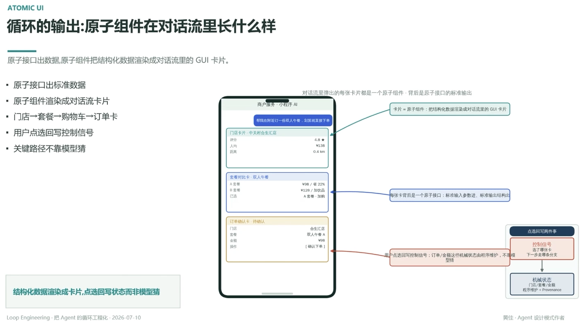

# 循环的输出：原子组件在对话流里长什么样

> 原子接口出数据，原子组件把结构化数据渲染成对话流里的 GUI 卡片

- 原子接口出标准数据
- 原子组件渲染成对话流卡片
- 门店→套餐→购物车→订单卡
- 用户点选回写控制信号
- 关键路径不靠模型猜

## 对话流里的卡片链

门店卡片（中关村合生汇店：评分 4.8★、人均 ¥138、距离 0.4km）→ 套餐对比卡（双人午餐：A 套餐 ¥98/省 22%、B 套餐 ¥128/加饮品，已选 A 套餐·加购）→ 订单确认卡（待确认：门店/套餐/金额，操作【确认下单】）

对话流里弹出的每张卡片都是一个原子组件 —— 背后是原子接口的标准输出：**卡片 = 原子组件**：把结构化数据渲染成对话流的 GUI 卡片；每张卡背后是一个原子接口：标准输入参数进、标准输出结构出

## 点选回写两件事

用户点选回写控制信号；订单/金额这些机械状态由程序维护，不靠模型猜

- **控制信号**：选了哪张卡 → 下一步走哪条分支
- **机械状态**：门店/套餐/金额，程序维护 + Provenance（见 [[17.每个参数都要有唯一可审计的来源]]）

---

**结构化数据渲染成卡片，点选回写状态而非模型猜**

---
*Loop Engineering · 把 Agent 的循环工程化 · 2026-07-10*
*黄佳 · Agent 设计模式作者*
