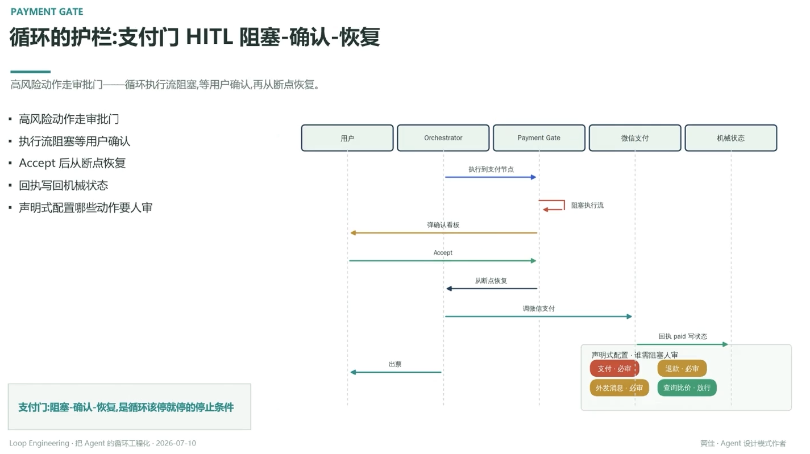

# 循环的护栏：支付门 HITL 阻塞-确认-恢复

> 高风险动作走审批门——循环执行流阻塞，等用户确认，再从断点恢复

- 高风险动作走审批门
- 执行流阻塞等用户确认
- Accept 后从断点恢复
- 回执写回机械状态
- 声明式配置哪些动作要人审

## 时序：用户 → Orchestrator → Payment Gate → 微信支付 → 机械状态

用户执行到支付节点 → Orchestrator 阻塞执行流 → Payment Gate 弹确认看板给用户 → 用户 Accept → 从断点恢复 → Orchestrator 调微信支付 → 回执 `paid` 写状态（机械状态）→ 出票 → 返回用户

## 声明式配置 · 谁需阻塞人审

- 支付 · 必审
- 退款 · 必审
- 外发消息 · 必审
- 查询比价 · 放行

---

**支付门：阻塞-确认-恢复，是循环该停就停的停止条件**

---
*Loop Engineering · 把 Agent 的循环工程化 · 2026-07-10*
*黄佳 · Agent 设计模式作者*
