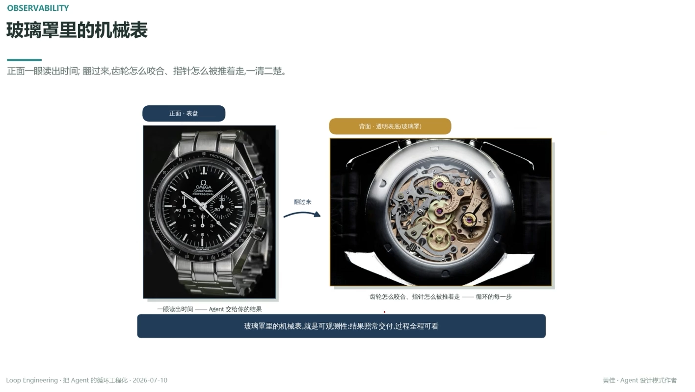

# 玻璃罩里的机械表

> 正面一眼读出时间；翻过来，齿轮怎么咬合、指针怎么被推着走，一清二楚

- 正面·表盘：一眼读出时间 —— Agent 交给你的结果
- 背面·透明表底（玻璃罩）：齿轮怎么咬合、指针怎么被推着走 —— 循环的每一步
- 结果照常交付，过程全程可看

---

**玻璃罩里的机械表，就是可观测性：结果照常交付，过程全程可看**

---
*Loop Engineering · 把 Agent 的循环工程化 · 2026-07-10*
*黄佳 · Agent 设计模式作者*
