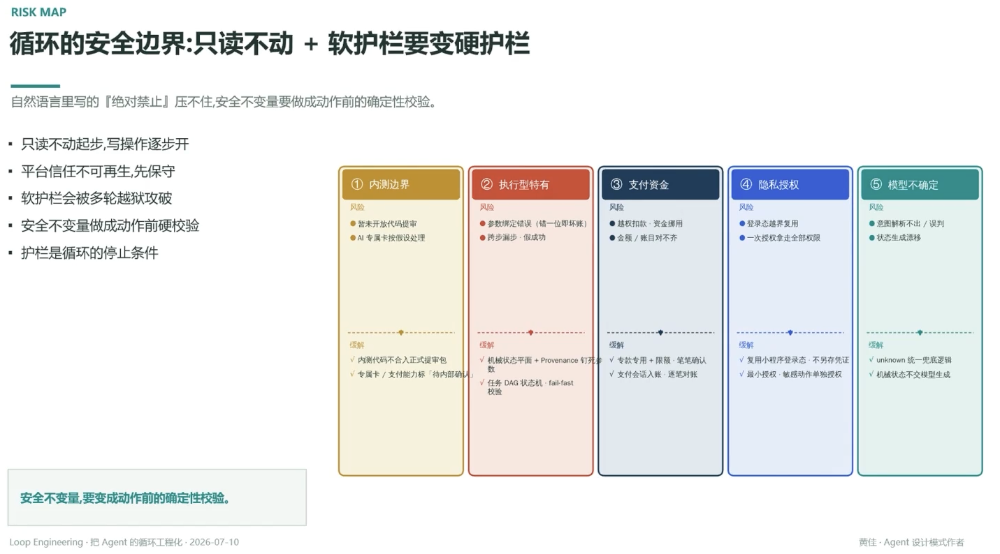

# 循环的安全边界：只读不动 + 软护栏要变硬护栏

> 自然语言里写的『绝对禁止』压不住，安全不变量要做成动作前的确定性校验

- 只读不动起步，写操作逐步开
- 平台信任不可再生，先保守
- 软护栏会被多轮越狱攻破
- 安全不变量做成动作前硬校验
- 护栏是循环的停止条件

## 五类风险 · 缓解

1. **内测边界**：暂未开放代码提审、AI 专属卡按假设处理 → 内测代码不合正式提审包；专属卡/支付能力标「待内部确认」
2. **执行型特有**：参数绑定错误（错一位即坏账）、跨步漏步·假成功 → 机械状态平面 + Provenance 钉死参数（见 [[16.循环跨步传参的命门机械状态平面]] [[17.每个参数都要有唯一可审计的来源]]）；任务 DAG 状态机·fail-fast 校验
3. **支付资金**：越权扣款·资金挪用、金额/账目对不齐 → 专款专用 + 限额·逐笔确认；支付会话入账·逐笔对账
4. **隐私授权**：登录态越界复用、一次授权拿走全部权限 → 复用小程序登录态·不另存凭证；最小授权、敏感动作单独授权
5. **模型不确定**：意图解析不出/误判、状态生成漂移 → unknown 统一兜底逻辑；机械状态不交模型生成

---

**安全不变量，要变成动作前的确定性校验**

---
*Loop Engineering · 把 Agent 的循环工程化 · 2026-07-10*
*黄佳 · Agent 设计模式作者*
