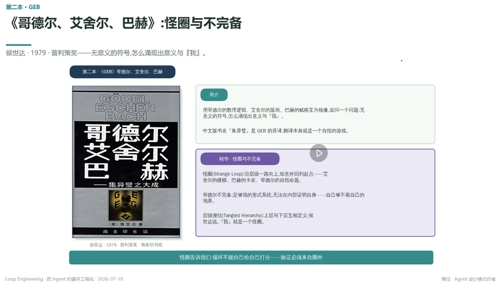

# 《哥德尔、艾舍尔、巴赫》：怪圈与不完备

> 侯世达 · 1979 · 普利策奖——无意义的符号，怎么涌现出意义与『我』

## 简介

用哥德尔的数理逻辑、艾舍尔的版画、巴赫的赋格互为镜像，追问一个问题：无意义的符号，怎么涌现出意义与『我』

中文版书名「集异璧」是 GEB 的音译，翻译本身就是一个自指的游戏

## 精华 · 怪圈与不完备

**怪圈（Strange Loop）**：沿层级一路向上，却意外回到起点——艾舍尔的楼梯、巴赫的卡农、哥德尔的自指命题

**哥德尔不完备**：足够强的形式系统，无法在内部证明自身——自己够不着自己的地基

**层级缠结（Tangled Hierarchy）**：上层与下层互相定义；侯世达说，『我』就是一个怪圈

---

**怪圈告诉我们：循环不能自己给自己打分——验证必须来自圈外**

---
*Loop Engineering · 把 Agent 的循环工程化 · 2026-07-10*
*黄佳 · Agent 设计模式作者*
