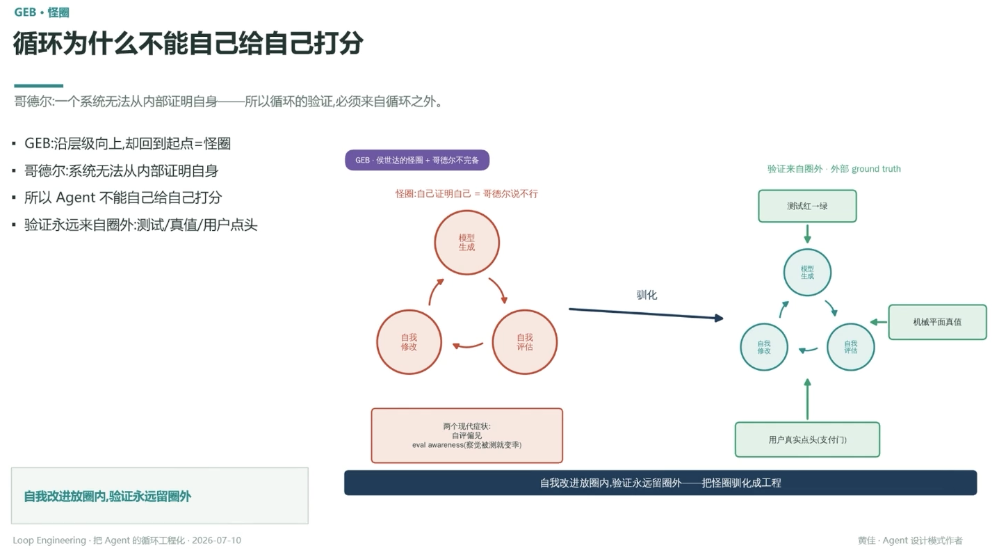

# GEB · 怪圈：循环为什么不能自己给自己打分

> 哥德尔：一个系统无法从内部证明自身——所以循环的验证，必须来自循环之外

- GEB：沿层级向上，却回到起点 = 怪圈
- 哥德尔：系统无法从内部证明自身
- 所以 Agent 不能自己给自己打分
- 验证永远来自圈外：测试/真值/用户点头

## 怪圈 → 驯化

**怪圈**：自己证明自己 = 哥德尔说不行 —— 模型生成 → 自我评估 → 自我修改 → 回到模型生成，闭环打转，两个现代症状：自评偏见、eval awareness（察觉被测就变乖）

**驯化**：把闭环拆开，插入圈外锚点——模型生成 → 自我评估（外部 ground truth 输入：机械平面真值）→ 自我修改（外部输入：用户真实点头，即支付门）→ 测试红→绿 → 回到模型生成

验证来自圈外 · 外部 ground truth（见 [[22.循环的护栏支付门HITL阻塞确认恢复]] 的支付门确认）

---

**自我改进放圈内，验证永远留圈外——把怪圈驯化成工程**

---
*Loop Engineering · 把 Agent 的循环工程化 · 2026-07-10*
*黄佳 · Agent 设计模式作者*
