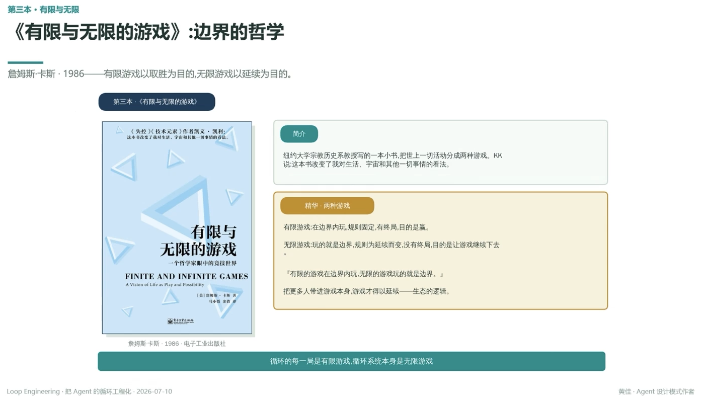

# 《有限与无限的游戏》：边界的哲学

> 詹姆斯·卡斯 · 1986——有限游戏以取胜为目的，无限游戏以延续为目的

## 简介

纽约大学宗教历史系教授写的一本小书，把世上一切活动分成两种游戏。KK 说：这本书改变了我对生活、宇宙和其他一切事情的看法

## 精华 · 两种游戏

**有限游戏**：在边界内玩，规则固定，有终局，目的是赢

**无限游戏**：玩的就是边界，规则为延续而变，没有终局，目的是让游戏继续下去

『有限的游戏在边界内玩，无限的游戏玩的就是边界』

把更多人带进游戏本身，游戏才得以延续——生态的逻辑

---

**循环的每一局是有限游戏，循环系统本身是无限游戏**

---
*Loop Engineering · 把 Agent 的循环工程化 · 2026-07-10*
*黄佳 · Agent 设计模式作者*
