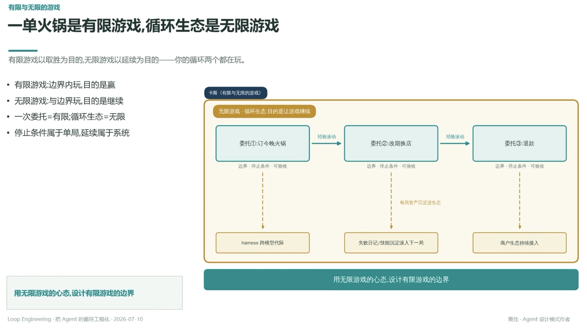

# 一单火锅是有限游戏，循环生态是无限游戏

> 有限游戏以取胜为目的，无限游戏以延续为目的——你的循环两个都在玩

- 有限游戏：边界内玩，目的是赢
- 无限游戏：与边界玩，目的是继续
- 一次委托 = 有限；循环生态 = 无限
- 停止条件属于单局，延续属于系统

## 无限游戏·循环生态：目的是让游戏继续

委托①订今晚火锅 → 经验演动 → 委托②改期换店 → 经验演动 → 委托③退款

每一局委托都有边界·停止条件·可验收（见 [[27.有限与无限的游戏边界的哲学]]），但每局资产沉淀进生态：

- 委托① → harness 跨模型代际
- 委托② → 失败日记/技能沉淀滚入下一局（见 [[05.礼待错误自下而上变自生变]]）
- 委托③ → 商户生态持续接入

---

**用无限游戏的心态，设计有限游戏的边界**

---
*Loop Engineering · 把 Agent 的循环工程化 · 2026-07-10*
*黄佳 · Agent 设计模式作者*
