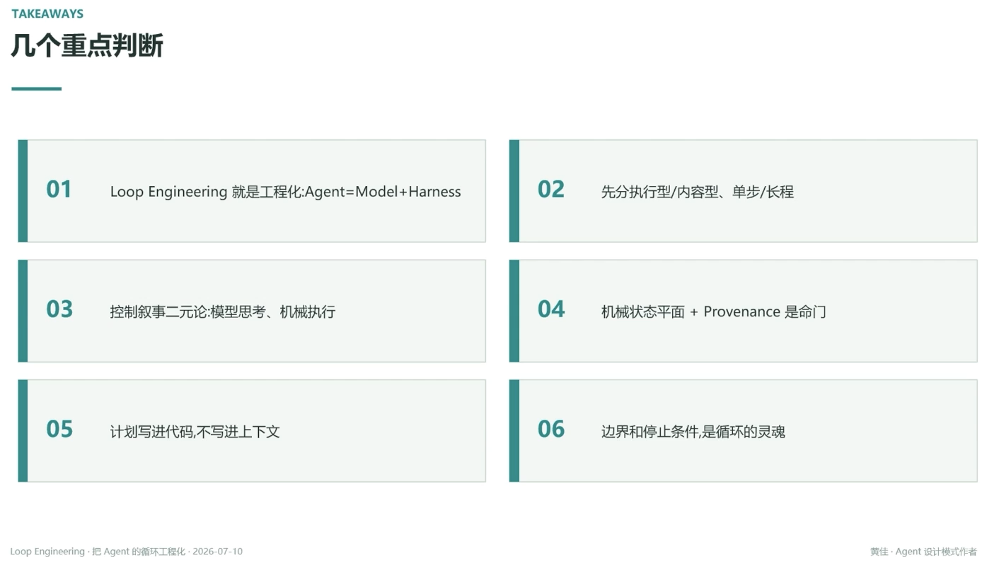

# TAKEAWAYS：几个重点判断

01. Loop Engineering 就是工程化：Agent = Model + Harness
02. 先分执行型/内容型、单步/长程
03. 控制叙事二元论：模型思考、机械执行（见 [[08.控制平面vs叙事平面]] [[09.定律Agent思考机械平面执行]]）
04. 机械状态平面 + Provenance 是命门（见 [[16.循环跨步传参的命门机械状态平面]] [[17.每个参数都要有唯一可审计的来源]]）
05. 计划写进代码，不写进上下文（见 [[19.把循环从走一步看一步升级成先钉死再执行]]：让计划活在代码里，让创意活在上下文里）
06. 边界和停止条件，是循环的灵魂

---
*Loop Engineering · 把 Agent 的循环工程化 · 2026-07-10*
*黄佳 · Agent 设计模式作者*
