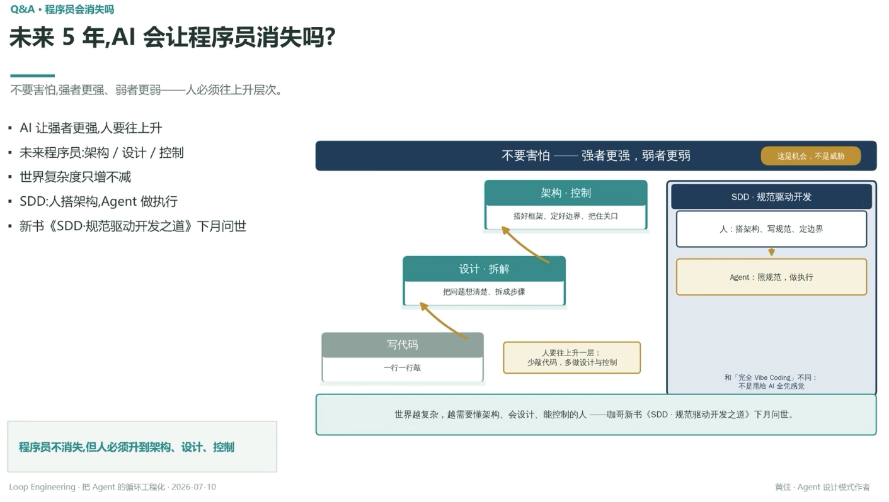

# Q&A · 程序员会消失吗：未来 5 年，AI 会让程序员消失吗？

> 不要害怕，强者更强、弱者更弱——人必须往上升层次

- AI 让强者更强，人要往上升
- 未来程序员：架构/设计/控制
- 世界复杂度只增不减
- SDD：人搭架构，Agent 做执行
- 新书《SDD·规范驱动开发之道》下月问世

## 三层往上升

写代码（一行一行敲）→ 设计·拆解（把问题想清楚、拆成步骤）→ 架构·控制（搭好框架、定好边界、把住关口）

人要往上升一层：少敲代码，多做设计与控制

## SDD · 规范驱动开发

人：搭架构、写规范、定边界 → Agent：照规范，做执行

和「完全 Vibe Coding」不同：不是用给 AI 全凭感觉（参见 [[03.SDD四层金字塔]]）

世界越复杂，越需要懂架构、会设计、能控制的人

---

**程序员不消失，但人必须升到架构、设计、控制**

---
*Loop Engineering · 把 Agent 的循环工程化 · 2026-07-10*
*黄佳 · Agent 设计模式作者*
