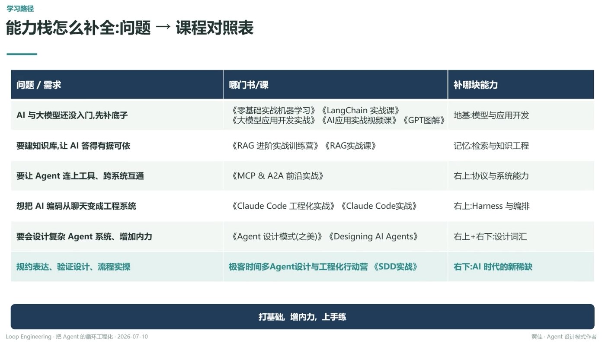

# 学习路径：能力栈怎么补全：问题 → 课程对照表

## 问题 / 需求 → 哪门书/课 → 补哪块能力

| 问题/需求 | 哪门书/课 | 补哪块能力 |
|---|---|---|
| AI 与大模型还没入门，先补底子 | 《零基础实战机器学习》《LangChain 实战课》《大模型应用开发实战》《AI应用实战视频课》《GPT图解》 | 地基：模型与应用开发 |
| 要建知识库，让 AI 答得有据可依 | 《RAG 进阶实战训练营》《RAG实战课》 | 记忆：检索与知识工程 |
| 要让 Agent 连上工具、跨系统互通 | 《MCP & A2A 前沿实战》 | 右上：协议与系统能力 |
| 想把 AI 编码从聊天变成工程系统 | 《Claude Code 工程化实战》《Claude Code实战》 | 右上：Harness 与编排 |
| 要会设计复杂 Agent 系统、增加内力 | 《Agent 设计模式(之美)》《Designing AI Agents》 | 右上+右下：设计词汇 |
| 规约表达、验证设计、流程实操 | 极客时间多Agent设计与工程化行动营《SDD实战》 | 右下：AI 时代的新稀缺 |

「右上/右下」对应 [[01.工程师新能力四象限]] 的四象限坐标

---

**打基础，增内力，上手练**

---
*Loop Engineering · 把 Agent 的循环工程化 · 2026-07-10*
*黄佳 · Agent 设计模式作者*
